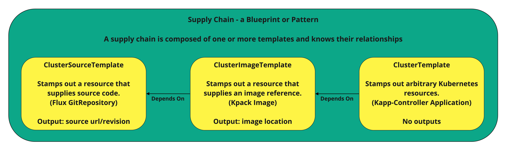
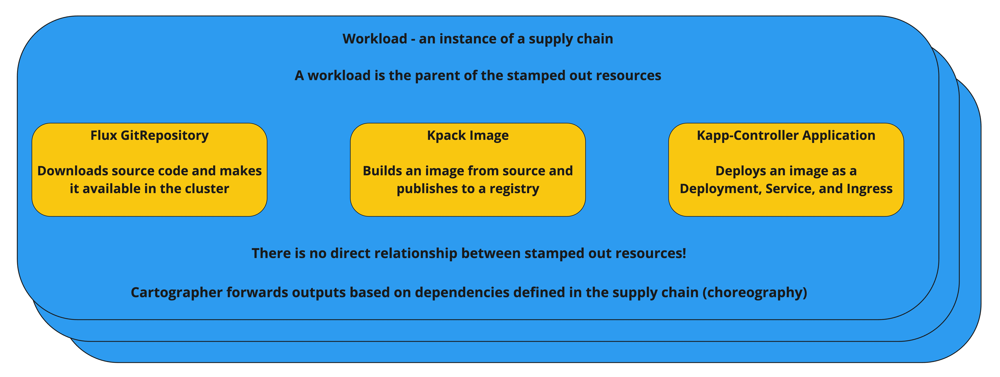

# Create a Custom Supply Chain

In this exercise, we will create a custom supply chain that:

1. Retrieves source code from Git and watches for updates
2. Builds and publishes an images with Kpack
3. Uses a Kapp-Controller application consisting of a deployment, service, and ingress to deploy the application

This is similar to the out-of-the-box supply chain except that it does not use Knative to deploy the application.
Our supply chain will be simpler than the out-of-the-box supply chain - at the loss of some flexibility.
We will also reuse one part of the existing supply chain to show how Cartographer can compose supply
chains from reusable parts.

Along the way we will learn how Cartographer is configured and extended.

This exercise will work equally well on a TCE cluster with the app-toolkit installed, or a TAP cluster
with the "full" profile installed. There are a few configuration differences we will point out as we progress.

The easiest way to run the examples in this workshop is to clone this repository locally, then change the
[solution/values.yaml](./solution/values.yaml) file to match your install of TAP or TCE.
This workshop has been tested with TAP 1.2.1 and TCE 0.12.1.

All commands assume you have a command window open to the same directory as this README file.

This workshop uses a Spring Boot application with a Swagger UI as the default application. The source code for that
application is here: https://github.com/jeffgbutler/java-payment-calculator. You may use that application for testing
if you wish. If you want to test triggering a supply chain with a commit, then please fork the repo and change the
Git URL in the workload definition. You may also use any other application you desire as long as it can be built with
Cloud Native Buildpacks and Kpack (most SpringBoot, .Net Core, and NodeJS applications should work).

## Pre-Requisites: Carvel Tools

In this exercise we will assume that you are familiar with the Carvel tools ytt, kapp, kapp-controller, kctrl, and kbld.
If you are not yet familiar with those tools we suggest you go through the
[Carvel Tutorial](../90-Carvel/README.md) first.

## Pre-Requisites: Cartographer Concepts

The exercises in this section will make far more sense if you understand the basic architecture and concepts
of Cartographer. If Cartographer is new to you, then we suggest reviewing the information in the
[Cartographer Overview](../06-cartographer/README.md) before proceeding. We will provide a quick review below.

In this exercise we will make use of three ideas that are core to Cartographer:

1. A `Template` is a resource that can create (or "stamp out") other Kubernetes resources. A template is just a pattern
   for creating a resource. No actual resources are created until a workload is created. Some templates have defined
   output variables than can be forwarded to other templates. Reading output variables from a stamped out resource and
   modifying other stamped out resources the changes is one of the core functions of Cartographer.
2. A `Supply Chain` is a blueprint composed of one or more templates. Again, a supply chain is just a pattern.
3. A `Workload` is an instance of a supply chain. The workload resource understands the resources that have been stamped
   out on its behalf, and understands the dependencies between those resources.

In this exercise we will create a new supply chain consisting of three templates. The corresponding workload
will have several resources stamped out. The following diagrams illustrate what we will create.

The supply chain will have three templates that match the three steps outlined above:

We can create one - or more - workloads based on this supply chain:

[Next (Creating the Cluster Source Template) -&gt;](01-ClusterSourceTemplate.md)
