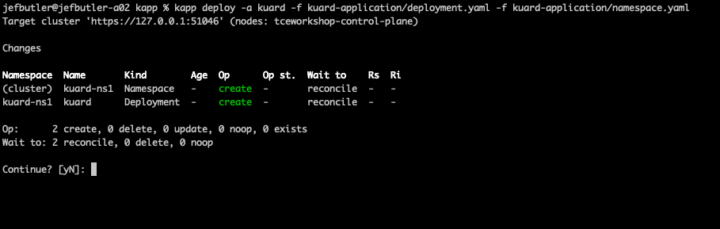
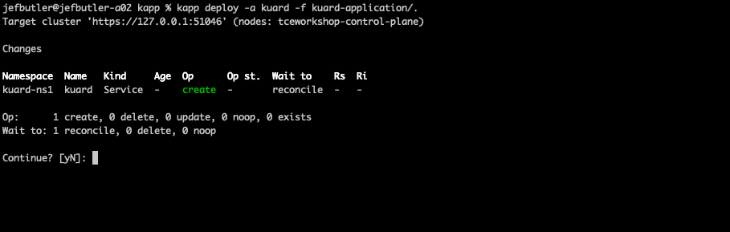
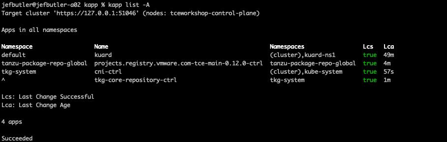
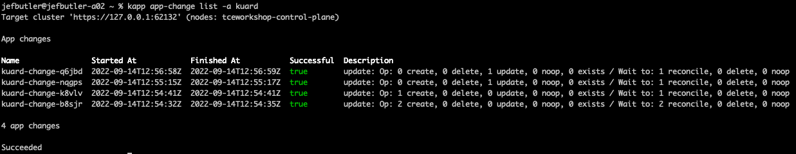
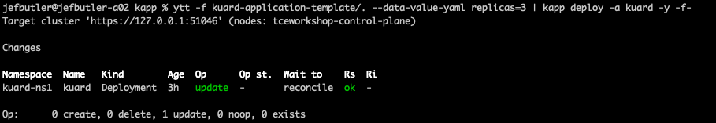
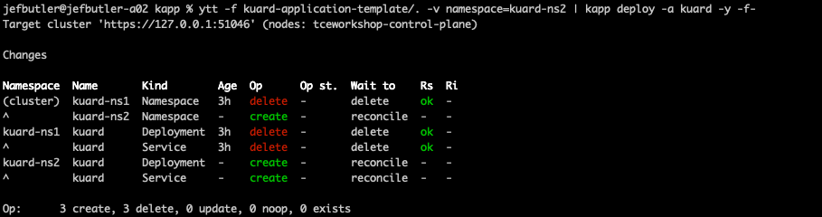

# Kapp Overview

The kapp CLI understands how to install and update applications on Kubernetes.
In the kapp way of thinking, an "application" is a collection of Kubernetes resources that can be considered
parts of a single thing.

**Important: The kapp CLI does not require anything to be installed on a Kubernetes cluster.** Every
action is calculated on the workstation where the kapp command is run. Also, kapp does not require any special
privileges in a cluster - if the signed-in user has authority to create the resources requested in a kapp
application, then kapp can do its work.

The Carvel tool "kapp-controller" can be used to run kapp in a cluster - we will look at the kapp-controller in a
separate exercise.

Full details about the Kapp CLI are here: https://carvel.dev/kapp/

## Creating a Kubernetes Application

Suppose we want to install an application and make it available on our cluster. This might involve the
following:

1. Create a namespace
2. Create a deployment
3. Create a service

These resources work together to comprise the application. But they are independent resources and could be
managed independently. If we need to make changes, or delete the application, we need to remember to work
with every resource.

Further, we need to create these resources in the correct order. The namespace would need to exist before the other
resources could be added to it.

This scenario is where kapp is useful. Kapp can understand these three things as parts of a larger "application".

## How does Kapp Work?

Kapp parses Kubernetes YAML and then calculates a "diff" with what's actually deployed on a cluster. Kapp then displays
a summary of the changes it will make and the order in which it will do those changes. By default, it will wait for all
resources to reconcile.

Calculating the "diff" is one of the most powerful features of kapp. Kapp can navigate very complex changes in application
structure.

## Deploying and Modifying Applications with Kapp

**Important:** The commands in this section assume you have a command window open in the same directory as this README file!

The directory [kuard-application](kuard-application/) contains three YAML files for an application: a namespace, a deployment,
and a service. Let's start by creating just the namespace and the deployment:

```shell
kapp deploy -a kuard -f kuard-application/deployment.yaml -f kuard-application/namespace.yaml
```

This instructs kapp to deploy an application named "kuard" composed of two YAML files. When we execute this command, kapp will
read the two YAML files we specified and calculate a diff. Since nothing is currently deployed, kapp will calculate that it
needs to create a namespace and a deployment. It will also determine that the namespace should be created first. The resulting
output looks like this:



When we enter "y", kapp will create the namespace and the deployment, waiting for each to reconcile.

Now let's add the service. In this case, we'll tell kapp to use all the files in the `kuard-application` directory.
We enter the following command:

```shell
kapp deploy -a kuard -f kuard-application/.
```

The output looks like this:



You can see that kapp has determined that the namespace and deployment are already in the cluster, so only the service needs to be created.

Now let's scale up the application. Change the number of replicas in [kuard-application/deployment.yaml](kuard-application/deployment.yaml)
to 2, then run the same deployment command as above. The output is as follows:


You can see that kapp has determined that only the deployment needs to be updated.

## Kapp Under the Covers

In addition to the resources created from the YAML we create, kapp also creates ConfigMaps on the cluster to keep track of
the current state of an application and all the different changes that have been made to it. Unless you specify differently,
those ConfigMaps will be in the default namespace for your context, and will be named based on the application name.
In my cluster, there are now four ConfigMaps related to the kuard application we created and modified in the last exercise.

It's important to understand that the definition of an application is tied to the namespace where the ConfigMaps live.

With the current exercise, the "kuard" application definition is in the default namespace even though the resources were
all created in the "kuard-ns1" namespace.

For example, if we enter the following command, kapp will find no applications in the namespace.

```shell
kapp list -n kuard-ns1
```

If you are not sure where an application definition is, you can find it by listing all apps in all namespaces:

```shell
kapp list -A
```

In my cluster, the answer looks like this:



This shows four applications. The "kuard" application we installed and three other applications that were installed
when the cluster was created. The "kuard" application is in the "default" namespace and kapp knows that resources
were created in the "kuard-ns1" namespace.

## Looking at History

Kapp keeps a history of all application changes. The history of each change is stored in a ConfigMap in the cluster.
Kapp has a command that will show the history:

```shell
kapp app-change list -a kuard
```

In my cluster, the answer looks like this:



In this output, the "name" of the change is also the name of the ConfigMap where the details of the change are stored.

## Inspecting Applications with Kapp

The kapp CLI has several commands that can show the state of applications:

The kapp "inspect" command will show all the resources currently in the cluster that are related to this application:

```shell
kapp inspect -a kuard
```

The kapp "logs" command will show logs from every pod in the cluster that is related to this application:

```shell
kapp logs -a kuard
```

You can also follow all pod logs with this command:

```shell
kapp logs -a kuard -f
```

You can delete an application and all it's resources with this command:

```shell
kapp delete -a kuard
```

## Combining Kapp and YTT

In the directory [kuard-application-template](kuard-application-template/) there is a set of ytt templates for the same kuard application.
The templates accept two values: "namespaces" and "replicas" with defaults "kuard-ns1" and "2" respectively. Note that the replicas value
is an integer - this will need some special care when calling ytt.

We can combine ytt and kapp to deploy or change the application as needed. When we pipe ytt output into kapp, we need to specify
the "-y" flag on the kapp command to apply changes without asking for confirmation because there will be no stdin available in that case.

First let's do a simply deploy that shouldn't change anything - the current state of the application should match the defaults:

```shell
ytt -f kuard-application-template/. | kapp deploy -a kuard -y -f-
```

This creates a consolidated YAML describing the application (wuth ytt defaults applied), pipes the output to kapp, and
instructs kapp to update the application without asking for confirmation. Kapp may report that no changes were required
if you didn't delete the application above.

Now let's change the number of replicas:

```shell
ytt -f kuard-application-template/. --data-value-yaml replicas=3 | kapp deploy -a kuard -y -f-
```

Now we've changed the number of replicas to three - kapp should report that the deployment needs to be updated and will wait until
that change reconciles.



Now let's try something more complex - let's change the namespace:

```shell
ytt -f kuard-application-template/. -v namespace=kuard-ns2 | kapp deploy -a kuard -y -f-
```

Kapp reconciles this change by deleting the old namespace "kuard-ns1" and recreating everything in the new namespace "kuard-ns2".



Kapp's ability to calculate a diff on old and new desired states, and then apply the changes in the correct order, make it a very
powerful tool in a GitOps workflow.

## Kapp Configuration

One of the primary functions of kapp is calculating a diff between current state and desired state, then applying those
changes in the correct order. Kapp is very good at this for many cases. In our examples we are using well known
Kubernetes resources and Kapp knows how to deal with them. But kapp may not understand how to apply changes for every
resource available on any particular cluster. To deal with this problem, kapp includes a very powerful configuration
mechanism.

If you examine the out-of-the-box supply chain, you will see a kapp configuration like this included in the
templates that deploy applications to Knative:

```yaml
apiVersion: kapp.k14s.io/v1alpha1
kind: Config
rebaseRules:
  - path: [metadata, annotations, serving.knative.dev/creator]
    type: copy
    sources: [new, existing]
    resourceMatchers: &matchers
      - apiVersionKindMatcher: {apiVersion: serving.knative.dev/v1, kind: Service}
  - path: [metadata, annotations, serving.knative.dev/lastModifier]
    type: copy
    sources: [new, existing]
    resourceMatchers: *matchers
```

I retrieved this from the following command:

<details><summary>TAP</summary>
<p>

```shell
kubectl get ClusterDeploymentTemplate app-deploy -o yaml
```

</p>
</details>

<details><summary>TCE</summary>
<p>

```shell
kubectl get ClusterTemplate app -o yaml 
```

</p>
</details>

We won't dig into the details of this configuration except to say that it informs kapp of some annotations
specific to Knative that kapp should manage. Note that this is not YAML for a Kubernetes resource - it is YAML to
configure kapp. You should include configuration YAML in the set of fies that is deployed in a kapp application,
but it is strictly to alter the execution of kapp. Nothing is deployed on a cluster as a result of this YAML alone.

If you want to see the details of kapp's default configuration, you can retrieve it with the following command:

```shell
kapp deploy-config
```

Warning - it is a huge amount of configuration detail!

You can read all about kapp configuration in the documentation here: https://carvel.dev/kapp/docs/v0.52.0/config/

If kapp doesn't calculate the correct order for changes with your resources, you can also add annotations
to the resource definitions that will alter the order of execution. You can read about that
here: https://carvel.dev/kapp/docs/v0.52.0/apply-ordering/


Next we'll see how to run kapp in a cluster with the kapp-controller.

[Next (Kapp-Controller Overview) -&gt;](../kapp-controller/README.md)
